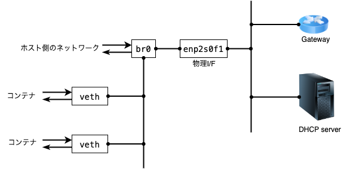

# LXD セットアップ + 使い方

## 
 - LXC でホストとコンテナ、コンテナと外部を同じネットワークで繋げるようにする
 - 使う OS はFedora release 36

## 前準備


コンテナとホストの接続はブリッジを使うと楽なので適当なブリッジインタフェースを用意する。
STPはデフォルト有効なので不要なら切っておく。不要なトラブルを避ける意味で物理インタフェースの設定前に切っておくといい。

```
nmcli con add type bridge ifname br0
nmcli con mod bridge-br0 connection.id br0
nmcli con mod br0 bridge.stp no
nmcli con add type bridge-slave ifname enp2s0f1 master br0
```

## インストール
LXD は Ubuntu 系が主に開発しているため yum/dnf でサクッとインストールできない。
なので、ディストリビューションに依存しないでインストールできる仕組みの snapd を入れる。
```
dnf -y install snapd
systemctl start snapd.seeded.service
```
そのあと snapd 経由で lxd を入れる。(バージョン指定する時は `--channel=3.0/stable` を lxd の後につける)
```
snap install lxd
```

## 初期化
lxd の初期設定。今回はあらかじめ作ったブリッジを利用するのでその周りの設定を入れる。
その他なんとなく入れている設定も残しておく。
1. "Name of the storage backend to use ~"
   - コンテナのストレージのタイプ。なるべくホスト側が利用している機能と別のやつを使っておいた方がいい。
      - ホストで lvm を使っていれば lxd のバックエンドは btrfs にする等
      - (lvm をホストとコンテナの両方で使っていてハングした時にホストごと動かなくなることがあった)
2.  Name of the new storage pool~
   - デフォルトでも構わないがあとでストレージプールを足すこともあるので適当な名前をつけておく
3. "Would you like to create a new network bridge?"
   - あらかじめ作ったブリッジを使うので "no" を指定する
   - "Name of the existing bridge or host interface" で作ったブリッジを指定する
4. "Would you like the LXD server to be available over the network?"
   - なんとなく no にしているけどコンテナのマイグレーションとか使う時に必要かも？

```
# lxd init
Would you like to use LXD clustering? (yes/no) [default=no]: 
Do you want to configure a new storage pool? (yes/no) [default=yes]: 
Name of the new storage pool [default=default]: strg0
Name of the storage backend to use (ceph, cephobject, dir, lvm, btrfs) [default=btrfs]: 
Would you like to create a new btrfs subvolume under /var/snap/lxd/common/lxd? (yes/no) [default=yes]: 
Would you like to connect to a MAAS server? (yes/no) [default=no]: 
Would you like to create a new local network bridge? (yes/no) [default=yes]: no
Would you like to configure LXD to use an existing bridge or host interface? (yes/no) [default=no]: yes
Name of the existing bridge or host interface: br0
Would you like the LXD server to be available over the network? (yes/no) [default=no]: no
Would you like stale cached images to be updated automatically? (yes/no) [default=yes]:    
Would you like a YAML "lxd init" preseed to be printed? (yes/no) [default=no]: 
# 
```

LXD は利用できるユーザを lxd グループに入れておく必要がある。
また、グループを変更した後は lxd の関連プロセスを再起動して反映しないといけない。
(systemctl restart ... は不十分かも？うまく反映されずに再起動した)
```
# gpasswd -a <user id> lxd
# systemctl restart snap.lxd.daemon snap.lxd.daemon.unix.socket
```

# コンテナを作る
ベースになるイメージを調べる
```
$ lxc image list images:
+------------------------------------------+--------------+--------+----------------------------------------------+--------------+-----------------+-----------+-------------------------------+
|                  ALIAS                   | FINGERPRINT  | PUBLIC |                 DESCRIPTION                  | ARCHITECTURE |      TYPE       |   SIZE    |          UPLOAD DATE          |
+------------------------------------------+--------------+--------+----------------------------------------------+--------------+-----------------+-----------+-------------------------------+
| almalinux/8 (3 more)                     | f13ed0def2e3 | yes    | Almalinux 8 amd64 (20221209_23:08)           | x86_64       | VIRTUAL-MACHINE | 660.44MB  | Dec 9, 2022 at 12:00am (UTC)  |
+------------------------------------------+--------------+--------+----------------------------------------------+--------------+-----------------+-----------+-------------------------------+
| almalinux/8 (3 more)                     | fbdb0968bf13 | yes    | Almalinux 8 amd64 (20221209_23:08)           | x86_64       | CONTAINER       | 128.43MB  | Dec 9, 2022 at 12:00am (UTC)  |
+------------------------------------------+--------------+--------+----------------------------------------------+--------------+-----------------+-----------+-------------------------------+
| almalinux/8/arm64 (1 more)               | 48ae0c8ff872 | yes    | Almalinux 8 arm64 (20221209_23:08)           | aarch64      | CONTAINER       | 124.90MB  | Dec 9, 2022 at 12:00am (UTC)  |
+------------------------------------------+--------------+--------+----------------------------------------------+--------------+-----------------+-----------+-------------------------------+
| almalinux/8/cloud (1 more)               | a2910add64d0 | yes    | Almalinux 8 amd64 (20221209_23:08)           | x86_64       | VIRTUAL-MACHINE | 679.19MB  | Dec 9, 2022 at 12:00am (UTC)  |

```

images: の後に調べたいキーワードをくっつけることもできる。
```
$ lxc image list images:rockylinux/9
+-------------------------------+--------------+--------+---------------------------------------+--------------+-----------------+----------+-------------------------------+
|             ALIAS             | FINGERPRINT  | PUBLIC |              DESCRIPTION              | ARCHITECTURE |      TYPE       |   SIZE   |          UPLOAD DATE          |
+-------------------------------+--------------+--------+---------------------------------------+--------------+-----------------+----------+-------------------------------+
| rockylinux/9 (3 more)         | 2d9e249e7705 | yes    | Rockylinux 9 amd64 (20221210_02:06)   | x86_64       | VIRTUAL-MACHINE | 565.82MB | Dec 10, 2022 at 12:00am (UTC) |
+-------------------------------+--------------+--------+---------------------------------------+--------------+-----------------+----------+-------------------------------+
| rockylinux/9 (3 more)         | cd84d085dd1c | yes    | Rockylinux 9 amd64 (20221210_02:06)   | x86_64       | CONTAINER       | 109.57MB | Dec 10, 2022 at 12:00am (UTC) |
+-------------------------------+--------------+--------+---------------------------------------+--------------+-----------------+----------+-------------------------------+
| rockylinux/9/arm64 (1 more)   | 7aa53d13efc0 | yes    | Rockylinux 9 arm64 (20221210_02:06)   | aarch64      | CONTAINER       | 105.57MB | Dec 10, 2022 at 12:00am (UTC) |
+-------------------------------+--------------+--------+---------------------------------------+--------------+-----------------+----------+-------------------------------+
| rockylinux/9/cloud (1 more)   | 12581adbb85b | yes    | Rockylinux 9 amd64 (20221210_02:06)   | x86_64       | CONTAINER       | 125.32MB | Dec 10, 2022 at 12:00am (UTC) |
+-------------------------------+--------------+--------+---------------------------------------+--------------+-----------------+----------+-------------------------------+
| rockylinux/9/cloud (1 more)   | f6f26ae5f520 | yes    | Rockylinux 9 amd64 (20221210_02:06)   | x86_64       | VIRTUAL-MACHINE | 585.69MB | Dec 10, 2022 at 12:00am (UTC) |
+-------------------------------+--------------+--------+---------------------------------------+--------------+-----------------+----------+-------------------------------+
| rockylinux/9/cloud/arm64      | 8297fb8ed6cf | yes    | Rockylinux 9 arm64 (20221210_02:06)   | aarch64      | CONTAINER       | 120.88MB | Dec 10, 2022 at 12:00am (UTC) |
+-------------------------------+--------------+--------+---------------------------------------+--------------+-----------------+----------+-------------------------------+
| rockylinux/9/cloud/ppc64el    | 82e5a3ae89ab | yes    | Rockylinux 9 ppc64el (20221210_02:06) | ppc64le      | CONTAINER       | 127.34MB | Dec 10, 2022 at 12:00am (UTC) |
+-------------------------------+--------------+--------+---------------------------------------+--------------+-----------------+----------+-------------------------------+
| rockylinux/9/ppc64el (1 more) | f69dbc86b419 | yes    | Rockylinux 9 ppc64el (20221210_02:06) | ppc64le      | CONTAINER       | 111.31MB | Dec 10, 2022 at 12:00am (UTC) |
+-------------------------------+--------------+--------+---------------------------------------+--------------+-----------------+----------+-------------------------------+
$ 
```

イメージが決まったら `lxc launch` でコンテナを作る
```
$ lxc launch images:rockylinux/9 container0 
Creating the instance    
$ lxc list                                                                             
+------------+---------+------+----------------------------------+-----------+-----------+ 
|    NAME    |  STATE  | IPV4 |             IPV6                 |   TYPE    | SNAPSHOTS | 
+------------+---------+------+----------------------------------+-----------+-----------+      
| container0 | RUNNING |      | 2001:0db8::3eff:fea7:1df3 (eth0) | CONTAINER | 0         |      
+------------+---------+------+----------------------------------+-----------+-----------+  
```


## ホストとコンテナでファイルを共有する
コンテナ側にホストのディレクトリを生やす。
```
lxc config device add container0 devname0 disk source=/host/dir path=/container/dir
```
LXC ではディスクデバイスを追加することで共有ディレクトリが作れる。コマンド中の devname0 はデバイスの識別子でユーザが適当に指定すればいい。
source にはホスト側のディレクトリのパスを指定、path にはコンテナ側のディレクトリを指定する。
コンテナ側のパスは勝手に作られるのであらかじめ用意する必要はなく、コンテナ側で mount をする必要もない。

なお、source に指定するパスはシンボリックリンクを含まないパスにする必要がある。もし含んでいればデバイスの追加に失敗する。

コンテナ側からファイルを書き込むとホスト側でみた時に適当な uid/gid で書き込まれたように見える。
これだと不便なので uid/gid をホストとコンテナでマッピングする。
例えば、ホスト側の uid 1000 と gid 1001 をコンテナ側の root (uid=0, gid=0) にマッピングする場合は以下のようにする。
```
$ echo -e "uid 1000 0\ngid 1001 0" | lxc config set container0 raw.idmap -
```

- lxc config set は `-` を指定することで標準入力から設定を投入できる。
- uid と gid はそれぞれ１行ずつ記述する必要があるので `echo -e` で改行文字を使って設定する。

## コンテナから cifs を使ってマウントする
事前にコンテナに設定を入れておくことで cifs とか nfs のファイルサーバをコンテナからマウントすることもできる。

```
lxc config set container0 raw.apparmor 'mount fstype=cifs,'
lxc config set container0 security.privileged true
```
security.privileged を `true` にする必要がある。

# 参考にしたサイト
 - https://www.hiroom2.com/2018/12/14/fedora-29-lxd-en/
 - https://linuxcontainers.org/ja/lxd/getting-started-cli/
